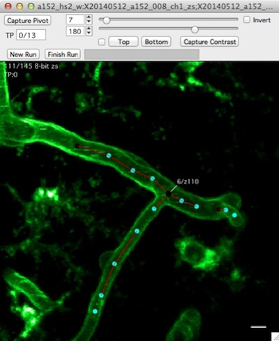
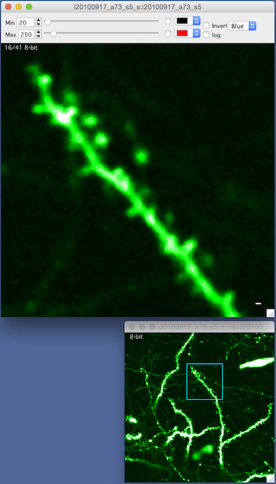

####Overview
A stack window displays a 3D image stack, one image plane (slice) at a time.

- Use the mouse-wheel to scroll up and down through images, arrow keys to pan, +/- to zoom.
- Image contrast is critical, open the contrast control bar with keyboard 'c' and adjust min/max contrast with sliders.
- View a pixel intensity histogram with keyboard 'h'.
- Closing a stack window does not remove it from memory (the stack remains open).

####Keyboard commands
  	Navigation
  		arrow-keys : Pan
  		+/- : zoom
  		Enter : Full Zoom (reset zoom)
  		] : Toggle between 2 different window sizes
  	Image Display
  		1 : Channel 1
  		2 : Channel 2
  		3 : Sliding Z-Project, Channel 1
  		4 : Sliding Z-Project, Channel 2
  		Shift+3 : Set parameters for sliding z-projection, Channel 1
  		Shift+4 : Set parameters for sliding z-projection, Channel 2
  	Toolbars
  		c : Toggle the contrast control bar
  	Child Windows
  		h : Histogram
  		z :maximal z-projection
  		shift+z : maximal z-projection (options)
  		i : Object Info Panel
  		shift+i : Stack Info Panel
  	Right-click menu
  		Capture XY
  		Set XY
  		Capture Window Size
  		Set Window Size
  		Stack Options Panel
  		Navigation  Window
  		Export Quicktime Movie... (export avi on Microsoft Windows)
  	Other
  		shift+C : Cycle candy (scale bar, scale bar + x/y axis, scale bar + x/y axis + scroll bar, etc. etc.)
  		s : Switch between two default stack window sizes (Set in Stack Browser Options)
  		shift+P : Set pixel/voxel size
  		/ : Start/Stop movie
  		shift + h : Print this help
  	Object (spine) Scoring
  		[ : Toggle left control bar
  		i : Object info panel
  		control+left_arrow : Go to previous spine
  		control+right_arrow : Go to next spine
  		control+click on point : Display Point Run (e.g. control+click on a spine)
  		control+click on line : Display Line Segment Run
  		l : Link windows (lower-case 'L' as in link)
  	Map (run plot)
  		a : Selected object -->> Addition
  		s : Selected object -->> Subtraction
  		p : Selected object -->> Persistent (requires selection in previous timepoint)
	    

####Right click

####Contrast bar
- Open the contrast bar with keyboard 'c'
- Pixel intensity values below 'min' will be displayed as black
- Pixel intensity values above 'max' will be displayed as white

####Histogram

The histogram window show a histogram of pixel intensity values for each image in a stack.

- Open the histogram window with keyboard 'h'.
- The histogram window shows a pixel intensity histogram for one image.
- Scroll through the image in a stack (mouse-wheel) and the histogram for each image will be show.

####Navigation window

The navigation window opens a new window with a maximal z-projection of the stack and shows the current zoomed view as a blue square.

- Right click and select 'Navigation Window' menu. A navigation window will be opened and your current zoomed view of the stack will be shown as a blue square.
- Zoom with +/- or pan with arrow keys and the blue-square tracks what you are looking at.
- The navigation window is, by default, a maximal z-projection of the entire stack.

####Point info

The Point Info window shows information about the currently selected object.  

- Open the Point Info window from any stack window using shift+?.  
- Use the point info window to annotate either nodes or edges with notes.
- Use the point info window to annotate edges as 'diving', 'surface', 'Has Pericyte' and 'Branch Order'.

####Important
- Contrast is critical, if not set properly you will not see objects in your image that are actually there.
- Closing a stack window does not remove the stack from memory.
- Zooming with keyboard +/- follows the mouse pointer

[1]: /Vascular-Analysis/hyperstack-panel/
