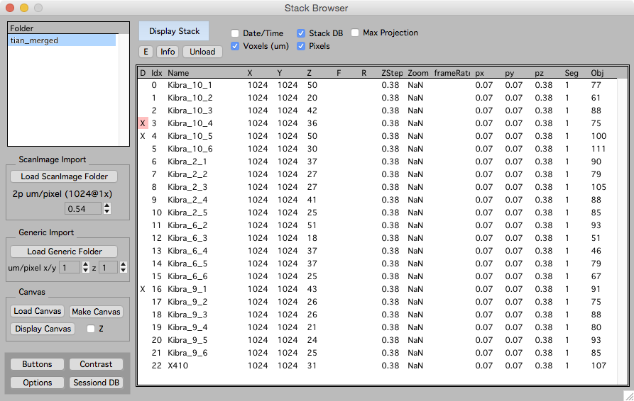

 
The stack browser provides an interface to load and browse directories of .tif [stacks][3].

The original documentation is [here][2]

###Loading stacks

Load ScanImage Directory.

Load Generic Directory.

Drag and drop a single .tif stack from the hard-drive.

###Browsing loaded data

Select your loaded directory on the left  and the loaded stacks will be shown on the right.

Double click a stack in the list on the right to open a [stack][3] window.

[1]: /mapmanager/stack-browser/
[2]: http://www.robertcudmore.org/maptracker/v2/stack-browser/
[3]: /mapmanager/stack/
