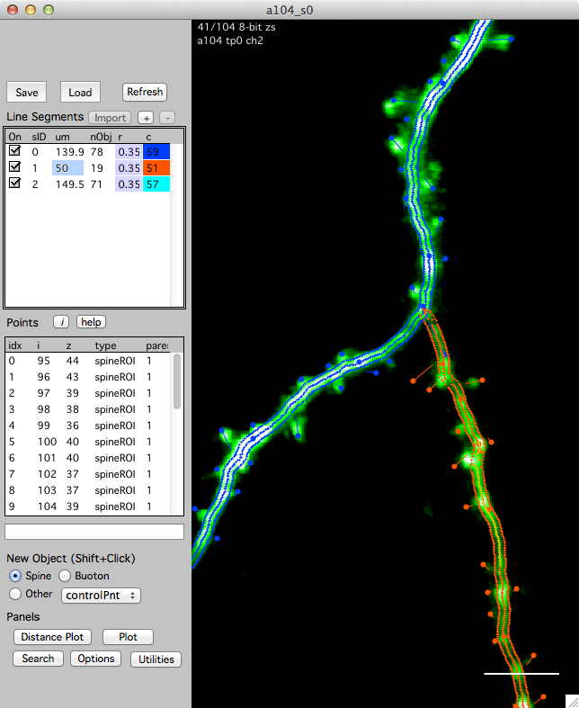
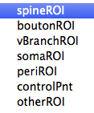

Stacks are annotated with 3D objects and line segments. Taken together, these 3D objects and line segments make a stack database (**stack db**).

This example shows a stack window and its stack db with three line segments and a number of 3D objects, spines in this case.

Open the stack db interface from any [stack][4] window using keyboard '['

###Creating 3D objects

Choose the type of object in the 'New Object' group and shift+click in the image to create the object.

- **Spine** : A spine is always connected to a segment (its parent segment). You can only create a spine if you first select the segment that will be its parent.  
- **Bouton** : This also requires a parent  
- vBranch :  
- soma :  
- peri :  
- **controlPnt** : Points along a segment that are used to fit a line in FIJI. 
- other :    
  
The different names allow you to organize your annotations into different groups. These groups can then be [searched][3], [plotted][5] and connect together in a [map][2].

<B>Tip.</B> All objects are 3D points. To create a new point with better precision, zoom in the stack window with keyboard '+'. The zoom will follow the mouse pointer. Zoom out again with keyboard '-' and return to the full view with keyboard 'enter'.

####Selecting an object

- Single-click on the object. Selected object will appear as yellow circles. PRess keyboard 'esc' to cancel a selection.

####Moving an object

- Select the object (single click), right-click and select 'Move'. Your next click will be the new 3D position of the object. You are given feedback in the bottom of the stack window. Press 'esc' to cancel a move.

####Deleting an object

- Select the object (single click), right-click and select 'Delete'. 
- Select the object (single-click) and hit the 'del' key.

###Creating line segments

Existing line segments are listed in the 'Line Segment' group. Each line segment has a length (um), a number of objects (nObj), a radius (r), and a color (c).

Line segments are created as follows:

 1. Make sure 'Edit Segments ' is turned on.
 2. Create a new (empty) line segment  
  Click '+' button in the 'Line Segment' group. This will create an empty line segment.

 3. Make a series of 3D **control point** objects along your dendrite/axon  
  - Select 'New Object -> Other -> Control Point'  
  - Shift-click in the image to create a **control point**.
  - Continue making **control points** along the desired line segment in the image.
  
 4. Fit the line in FIJI and import the resulting line segment back into map manager  
  - Right-click on the new line segment (in the top left list) and select 'Make From Control Points - FIJI'. This will open the xxx plugin in FIJI, fit a line to your **control points** and open the fitted line segment in the map manager stack window.

**Important:** When making control points, they need to be in order along a segment. If you 'double-back' a control point on the segment, the line fit with dumbly follow this ordering of control points. For help on the ordering of your control points, open the 'options' panel and turn on 'Control Point Help' with the 'On' button. If it all gets confusing you can just delete all your control points and start over.

**Important:** When making a map, you will be associating individual line segments  from one session to the next. For segments that you will connect together in a map, make sure your control points are in the same general direction along each segment. If your control points go left to right in session 1, they should also go left to right in session 2.

###Line segment radius

Each line segment has a fixed radius in um. Spines are connected to this radius.

To change the radius, double-click the radius for a segment and enter a new number. The radius of each segment is displayed in the 'r' column.

Setting the radius will reconnect all your spines to that new radius while preserving the spine connection point to the line.

To set all the radii of a run of connected segments, right click on the segment in the list and select 'Set run to same radius'.

###Line segment pivot points

When in a map, line segments need a 'pivot point'. Specify a pivot point for a segment by clicking a point in the segment, right-click and select the 'Set As Pivot' menu.

The pivot point should specify a region of the segment that is the same in all sessions. A good strategy is to choose a region of the segment near an obvious spine that is present in all sessions. Another strategy is to choose a pivot point where some other segment (dendrite) crosses near your segment as these tend to remain stable across time. Try and put the pivot point near the center of the segment, do not place it at either end. The pivot point is used to calculate a line distance along the segment (in um) which in turn will be used to auto-guess connections between objects (spines) across sessions.

[1]: /mapmanager/stack-plot/
[2]: /mapmanager/map-plot/
[3]: /mapmanager/search-panel/
[4]: /mapmanager/stack/
[5]: /mapmanager/plot-panel/

