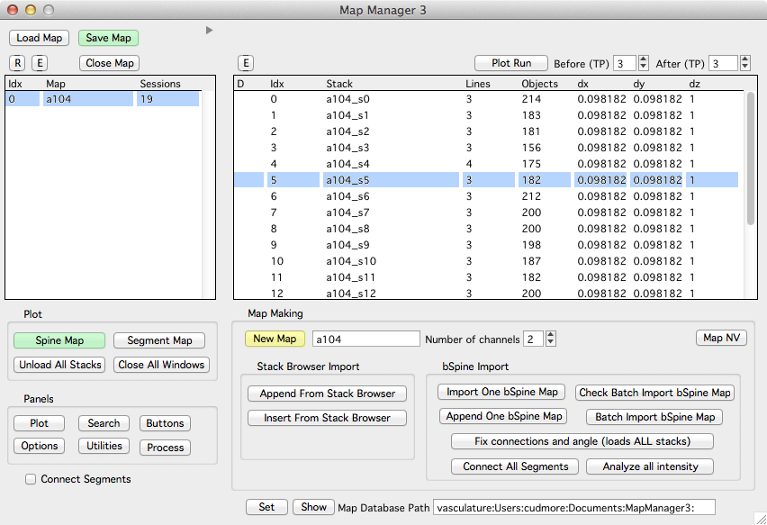
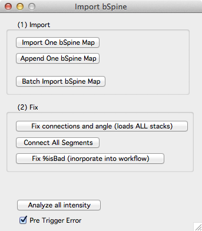

A map is a sequence of [stacks][2]. You create a map by appending stacks from the [stack browser][1]. Once a map is made it can be opened, saved, annotated, and browsed using the main [map maker panel][13].

The main Map Manager panel shows a list of open maps on the left. When a map is selected (rr22 in this example), a list of sessions in the map are shown on the right (in this example there are 6 sessions).

####Open and initialize Map Manager 

 1. Open Igor Pro with MapManager.ipf
 2. Initialize Map Manager with the main menu 'mm3 -> Load User File'
 
####1. Pre-process your raw data so Map Manager can import it
 - Map manager will only import single channel stacks. If your stacks have two color channels, they need to be de-interleaved into two different .tif files (one for each color channel). See [bAlignBatch][14] for a Fiji plugin that does this.

####2. Make a new map
 1. Fill in a new map name and choose the number of channels for each stack in your map.
 2. Create a new map with 'New Map'.
 3. Append a stack from the [Stack Browser][1] with 'Append Stack'.
 4. Repeat #3 for each stack.
 5. Save the map with 'Save Map' button.
 
####Important
 - When you make a map, you need to choose the 'Number Of Channels' in each stack/session. Map Manager will only allow one choice of 'Number Of Channels' per map. You cannot mix one and two channel stacks within a map.
 - Make sure the sessions in your map are imported in the correct order. It is hard to change the order later.
 - Make sure the scale of each imported stack is correct. It is hard to change the scale later.
 - New maps are saved to a default hard-drive folder. The default folder can be specified in a [user file][3] file. Right-click on a map name and select 'Show On HDD' to see the hard-drive folder where the map is saved.
   - On Windows, the default folder is 'My Documents'.
   - On OSX, the default folder is 'Documents'.
 - As you import stacks from the [stack browser][1] there are some rules that must be followed. You will be prompted when you break these rules. In particular:
   1. The stack scale must be set. Set the scale of a [stack][2] in a stack window with shift+p.
   2. The stack must be loaded. Double click the stack in the [stack browser][1] to load a stack.
   3. When importing 2 channel stacks, both channels must be loaded and you must select the first channel (ending in _ch1) in the stack browser.

####3. Create a line segment in each session/stack of the map
Line segments are first specified with control points and then fit using a custom FIJI plugin. Before fitting a line in FIJI, you need to install  the [Bob_Neurite_Tracer_v3][14] plugin in FIJI and you need to specify the path to your FIJI application in a [user file][3].

See [Fitting Segment In Fiji][15] for help on FIJI versions, installing the plugin and specifying the FIJI application path in Map Manager.

 1. Double-click the first session in your map (in the main Map Manager panel) to open a [stack][2] window.
 2. Create a line segment by follow the instruction in [annotating a stack][4].
 3. Repeat steps #1 and #2 for each session in your map. Making the same line segment in each session. As you make control points, be sure they are in the same direction along the segment for each session. For some help with the ordering of your control points, open the 'stack db options' panel and turn 'Control Point Help' 'On'.
 4. Set a pivot point in each line segment. Do this by clicking a point in the segment, right-click and select the 'Set As Pivot' menu. The pivot point should refer to the same region of the segment across all session. A good strategy is to choose a region of the segment near an obvious spine that is present in all sessions. Another strategy is to choose a pivot point where some other segment (dendrite) crosses near your segment as these tend to remain stable across time. Try and put the pivot point near the center of the segment, do not place it at either end. The pivot point is used to calculate a line distance along the segment (in um) which in turn will be used to auto-guess connections between spines across sessions.
 

<B>Tip.</B> You can open a stack run by right-clicking on a session and selecting 'Plot Run +- All'. Bring up the left control panel for each stack with keyboard'[' and follow the steps above. This way, you can see the line segments you are making in each session of your map.

####4. Connect your line segments together
 1. Close all stack windows using the Close Windows button in the main Map Manager panel.
 2. Open a new stack run by right-clicking a session in your map and selecting the 'Plot Run +- All' menu.
 3. Turn on the 'Connect Segments' checkbox in the main Map Manager panel. It is in the lower left of the panel.
 4. Sequentialy connect your line segment from one timepoint to the next
   - Select the source timepoint segment (for example, timepoint 1)
   - Select the destination timepoint segment (for example, timepoint 2)
   - In the destination timepoint (e.g. timepoint 2), press keyboard 'p' for Persistent.

<B>Tip.</B> You can see how your segments are connected by plotting a 'Segment Map' from the main Map Manager panel.

   
####5. Mark spines in each timepoint
 1. open a single timepoint by double clicking a session in the list.
 2. Follow [annotating a stack][4] to mark spines along your new segment.
 

<B>Tip.</B> As you are working, keep your eye on the Igor command window. Any small warnings will show up here. For example ...

   

####6. Auto connect spines from one timepoint to the next
 - Open a 'Spine Map' from the main Map Manager Panel.
 - In the spine map, select a spine in the first timepoint, right click and select 'Connect To Next'.
   This will make automatic connections of all spines from the first session to the next session.
 - Repeat this process for each pairwise session in your stack. You can right-click and select 'Connect All' to connect spines/objects through the entire map.
 
 
####7. Check the auto spine connections and edit as necessary

This is the core of Map Manager and you will spend most of your time doing this. You need to verify the auto connections of each spine and you need to do this between **each** timepoint in your map. If your map has 4 timepoints, you need to verify the auto spine connections between timepoint 1-2, timepoint 2-3, and timepoint 3-4.

 - Open a [run plot][11] of three sequential timepoints by right-clicking a spine in the spine map and selecting 'plot run +- 1'.
 - In the run plot windows, select a spine in the middle timepoint with ctrl+click. This will bring up the spine and its associated connections in all windows of the spine run. If there is no spine in a given timepoint, the image will be snapped to where the spine 'would-be'.
 - From the middle timepoint spine selection, go to the next spine along the segment using keyboard ctrl+right. Go to the previous spine along the segment using keyboard ctrol+left.
 - Correct any errors in the spine dynamics using keyboard 'a' for addition, 's' for subtraction, and 'p' for persistence. See [run plot][11] for details.
 
####8. Review your work by using search to query all additions and subtractions

 - Open the [search panel][5] from the main Map Manager panel with the 'Search' button.
 - In the search panel, make sure 'map' is slected and search for all spine additions with the 'Additions' button.
 - All added spines will appear as a list in the search results.
 - Right-click on a spine and select 'plot run +- 1' to bring up a spine run. [HERE I NEED TO CHANGE THE INTERFACE. I NEED A QUICKER WAY OF BRINING UP A SPINE RUN!!!]
 
**THIS IS WHERE I AM ENDING FOR NOW ON July 29 ... THIS NEEDS TO BE EXPANDED**
 
 
 
 
 
 
##DO NOT READ BELOW HERE !!!!
###[ADVANCED]: Importing a bSpine map

Importing bSpine maps is tricky. The problem is if your original maps for one time-series (_d1, _d2, etc.) have different sessions. For example, _d1 has sessions from dates 1,2,3 but _d2 has sessions from dates 1,2,6,12 there will be an error.

Thus, there are two cases:

 1. Your maps _d1, _d2 etc. all have the same exact sessions
 	This is simple, use 'Batch import bSpine map'. You will be prompted for the first map (you should select _d1). Once this is done, you need to hit all the buttons in '(2) fix' to complete the import and then 'save map' in the main Map Manager panel.
 	
 2. Your maps _d1, _d2 etc. have different sessions.
	This DOES NOT WORK.

 **This documentation is not done**
 
 ####Import group
 
 - **Import One bSpine map.** ... not done
 
 - **Append One bSpine map.** ... not done
 
 #### Fix group
 
  - ** I am sick of writing documentation. Please see Bob for instructions. **
 

[1]: /mapmanager/stack-browser/
[2]: /mapmanager/stack/
[3]: /mapmanager/user-files/
[4]: /mapmanager/annotating-a-stack/
[5]: /mapmanager/search-panel/
[6]: /mapmanager/plot-panel/
[7]: /mapmanager/stackdb-options-panel/
[8]: /mapmanager/process-panel/
[9]: /mapmanager/stack-browser/
[10]: /mapmanager/hdd-paths/
[11]: /mapmanager/run-plot/
[12]: /mapmanager/map-plot/
[13]: /mapmanager/main-panel/
[14]: https://github.com/cudmore/bob-fiji-plugins
[15]: /mapmanager/fitting-segments-in-fiji/
