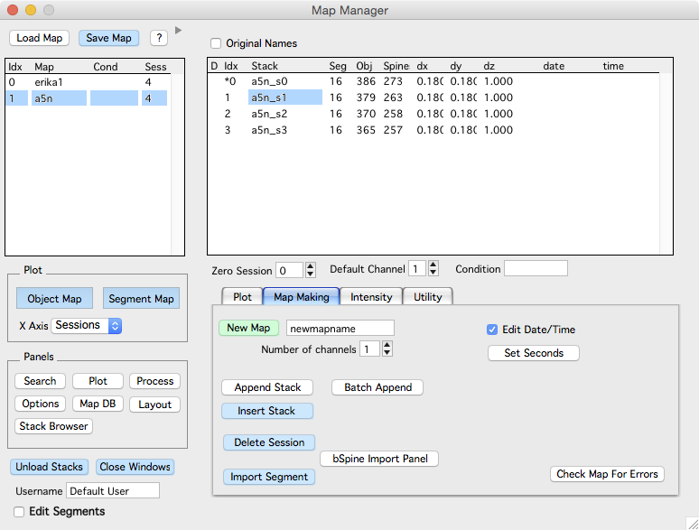

A map is a sequence of [stacks][2]. You create a map by appending stacks from the [stack browser][1]. Once a map is made it can be saved, opened/loaded, annotated, and browsed.

In the Map Manager 3 window, the list of open maps is on the left. When a map is selected, a list of sessions within the map is shown on the right.

Double-click a session to open a [stack][2] window and begin adding [3D annotations][4].

####Making a new map
 1. Create a new map with 'New Map'.
 2. Append a stack from the [Stack Browser][1] with 'Append Stack'.
 3. Repeat #2 for each stack.

####Important
 - Make sure the sessions in your map are imported in the correct order. It is hard to change the order later.
 - Make sure the scale of each imported stack is correct. It is hard to change the scale later.
 - New maps are saved to a default hard-drive folder. The default folder can be specified in a [user file][3] file. Right-click on a map name and select 'Show On HDD' to see the hard-drive folder where the map is saved.
   - On Windows, the default folder is 'My Documents'.
   - On OSX, the default folder is 'Documents'.
 - As you import stacks from the [stack browser][1] there are some rules that must be followed. You will be prompted when you break these rules. In particular:
   1. The stack scale must be set. Set the scale of a [stack][2] in a stack window with shift+p.
   2. The stack must be loaded. Double click the stack in the [stack browser][1] to load a stack.

####General usage

  Once a map is created and saved, the map maker 3 panel can be minimized with the disclosure triangle (at the top of the window near the help/? button).

  Online help is available with the '?' button.

  The blue buttons operate on the selected map.
  
  <B>Load Map.</B> Load a map from the hard-drive. 
  
  <B>Save Map.</B> Save the selected map.
  
  <B>?.</B> Open map manager 3 documentation in your default web browser.
  
####Plot Group
  
<B>Spine Map.</B> Open a [map plot][12] showing the position of spines along dendritic segments vs, session.

<B>Segment Map.</B>  Open a [map plot][12] showing the segments within each session and the connectivity of segments across sessions.

<B>X-Axis.</B> Choose different X-Axis for Spine and Segment map plots. Available X-Axis are:

 - Sessions 
 - Datetime
 - Days
 - Hours
 - Zero Sessions
 - Zero Days
 - Zero Hours
    
Date, Days and Hours require your imported stack to have a date specified. The X-Axis options starting with 'Zero' use a session in the map as a zero timepoint. Specify this with 'Zero Session' and 'Rebuild' in the expanded map manager 3 panel.
    
####Panel Group

Each of these buttons will open a different Map Manager panel.

<B>Search.</B> Open the [search panel][5].

<B>Plot.</B> Open the [plot panel][6].

<B>Buttons.</B> Open a button toolbar with other useful buttons.

<B>Options.</B> Open the [options panel][7].

<B>Utilities.</B> Only for advanced users. Do not use.

<B>Process.</B> Open the [process panel][8] to set image contrast.

<B>Stack Browser.</B> Open the [stack browser panel][9].

<B>HDD Paths.</B> Open a panel to [edit hard-drive paths][10] like the default folder to save and load maps.

####Miscellaneous

<B>Connect Segments.</B> When checked, all editing in a [run plot][11] will edit the persistence of segments (addition, subtraction, and persistent).

<B>Unload stacks.</B> Unload all stacks in the selected map (from Igor memory).

<B>Close Windows.</B> Close all windows associated with the selected map.

Right-click on a map name in the list for a contextual menu.

<B>Show on HDD.</B>

<B>Map stats.</B>

<B>Edit map NV.</B>

<B>Close map.</B> Close a map, removing it and all associated analysis from Igor memory.

####Importing a bSpine map

 Importing one by one
 
 - Import One bSpine map.
 
 - Append One bSpine map.
 
 Batch import
 
 - Batch Import bSPine map.
 

[1]: /mapmanager/stack-browser/
[2]: /mapmanager/stack/
[3]: /mapmanager/user-files/
[4]: /mapmanager/annotating-a-stack/
[5]: /mapmanager/search-panel/
[6]: /mapmanager/plot-panel/
[7]: /mapmanager/stackdb-options-panel/
[8]: /mapmanager/process-panel/
[9]: /mapmanager/stack-browser/
[10]: /mapmanager/hdd-paths/
[11]: /mapmanager/run-plot/
[12]: /mapmanager/map-plot/
