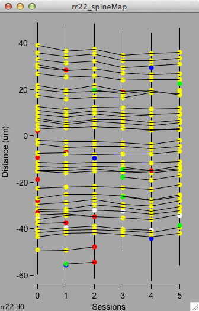
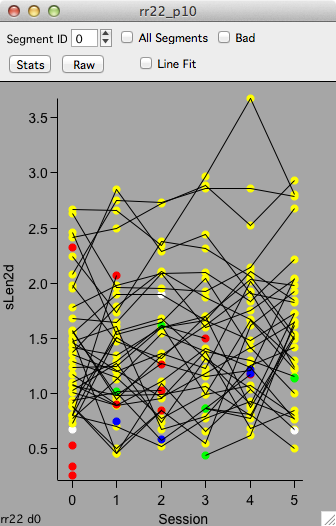
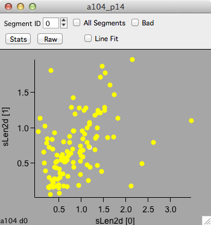

A map plot shows a map of spines across multiple imaging sessions.

All map plots are interactive. Selecting an object will propagate this selection to other map and [stack plots][2].

Make map plots from the main [plot panel][1]

####Colors
 - Green : Added
 - Red : Subtracted
 - Yellow : Persistent
 - White : Bad
 
####Interface
 - Segment ID. Plot individual segments. Use 'All Segments' to plot all segment.
 - Bad. Toggle display of bad objects.
 
 - Stats. Display a table of statistics for plotted data.
 - Raw. Display a table of raw data.
 - Line fit.
 
####Keyboard
 - C : toggle top control bar
 - E : Edit raw data in table
 - R : Refresh the plot

####Examples

This is a special case of a map plot to show the position of each spine on its dendritic segment.

Other map plots can be generated with the [plots][1] panel.
 

A map plot of sLen2d versus session.

A map plot of sLen2d for session 1 versus sLen2d for session 0.

[1]: /mapmanager/plot-panel/
[2]: /mapmanager/stack-plot/

