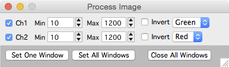

The process panel provides an interface to set global display parameters for a [stack][1]. The values specified in this panel will be used each time a new stack window is opened. These values are also saved when stack db options are saved in the [stack db options panel][2].

[1]: /mapmanager/stack/
[2]: /mapmanager/stackdb-options-panel/
