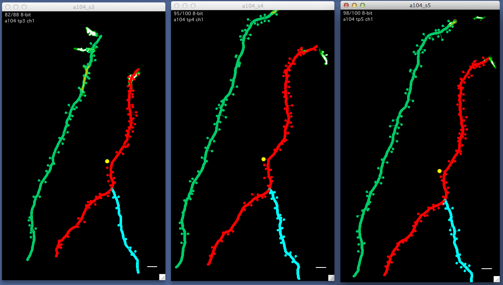
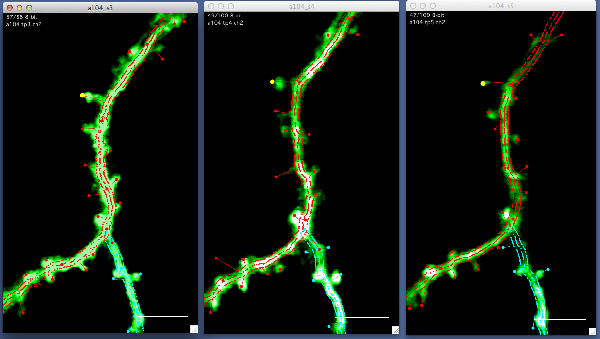

A run plot is a sequence of stack plots that follow a stack db point or line segment through a map.

####Opening a run plot
A run plot can be opened in various ways

 - Right-click an object in a [map plot][1]
 - Double-click an object in a [search][2]
 - Select 'plot run' in the main [map maker panel][3]
 
####Navigating a run plot
Keyboard 'l' will ink all stacks in a run plot allowing them to be zoomed and panned in synch.

Ctrol+click on an object in one stack plot of a run plot will select that object in all other stack plots of the run plot.

Example run plot following a spine (yellow circle) through multiple timepoints in a map.

Same run plot as above after zooming in.

[1]: /mapmanager/map-plot/
[2]: /mapmanager/search-panel/
[3]: /mapmanager/main-panel/
