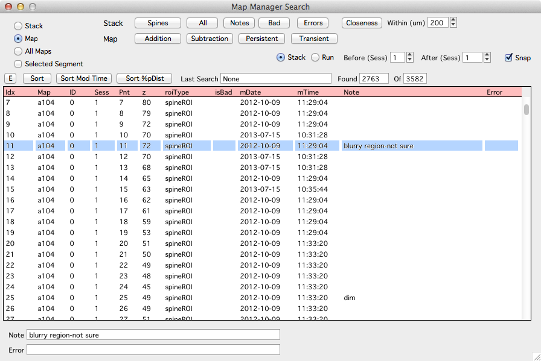

The search panel allows a stack or map to be searched for stack db objects.

Performing a search will create a list of object hits.

Selecting an entry in search results will select that object in any open [stack][3] and [map][2] plots.

Double-click an entry to open its corresponding [stack][3] or [run][4]
[1]: /mapmanager/stack-browser/
[2]: /mapmanager/map-plot/
[3]: /mapmanager/stack-plot/
[4]: /mapmanager/run-plot/

