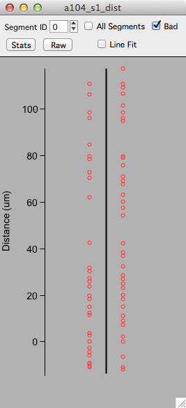
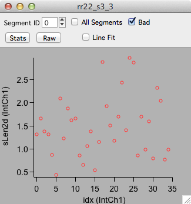

A stack plot shows a statistic for a single [stack][2].

All stack plots are interactive. Selecting an object will propagate this selection to other stack and [map plots][3].

Make stack plots from the main [plot panel][1]

Example stack plot of position of spines along a dendritic segment.

Example stack plot of sLen2d versus spine index.

[1]: /mapmanager/plot-panel/
[2]: /mapmanager/stack/
[3]: /mapmanager/map-plot/

