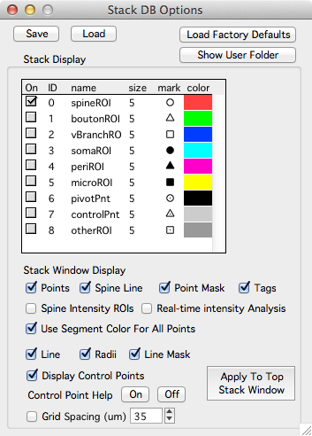

Stack DB options provides many options to control how a stack db is displayed.

From any stack db window, open stack db options with the 'Options' button.

The stack db options panel is split into two main sections, one short and one long.

The top section allows you to save and load one set of stack db options.

**Save.**

**Load.**

**Load Factory Defaults.**

**Show User Folder.** Shows the User file directory on the hard-disk. [User files][3] can be used to load a set of predefined options into map manager. For example, you can specify the default min/max of a stack display.

####Stack Window Display

Here you can toggle options on and off when annotating a [stack][1] with a [stack db][2]. Each time you change an option (e.g. 'points') you need to press 'Apply To Top Stack Window' for the changes to take effect.

**Points.** Toggle stack db objects on/off.

**Spine Line.**

**Point mask.** Turn point masking on/off. By default, stack db objects are  shown and not shown based on the image plane you are viewing.

**Tags.** In a stack window, the tags are the stack db point number. In a map, the tags are the **run** number of the point. See xxx.

**Spine Intensity ROIs.**

**Real-time intensity analysis.**

**Use segment color for all points.**

**Line.**

**Radii.**

**Line Mask.**

**Display Control Points**

**Control Point Help**

**Grid Spacing (um)**

####Points

**fill this in and make sure it works**

####Lines

**fill this in and make sure it works**

####Miscellaneous

**Warn On New Objects (shift-click)**

**New Objects On Mouse Click (no shift)**

**Line points to search when connecting spine/bouton**

**Left/Right arrows will scroll through line (otherwise pan)**

**Default Segment Radius (um)**

####Importing Segments From FIJI

**On import, Filter SWC Box Width**

**Filter Radius, Box Width**

**Convert To 8-bit**. Will convert to 8-bit (in Fiji). This makes line fit much faster.

**Close Fiji When Done**

####Intensity Analysis

**Width (um)**

**Extend Head (um)**

####Object Map
**Default Run +/-**. Set the number of sessions to display when selecting right-click menu 'Plot Run +- n'.

**Run Window Width (pixels)**. The size of each window in a spine run.

**Maximum Allowed Connection Distance (um)**. When using '', the threshold distance to allow an auto-connection between spines.

**Default Zoom Width (um)**. When snapping to a spine, the default zoom. The width of the window view in um.

**Default Zoom Height (um)**

[1]: /mapmanager/stack/
[2]: /mapmanager/annotating-a-stack/
[3]: /mapmanager/user-files/
