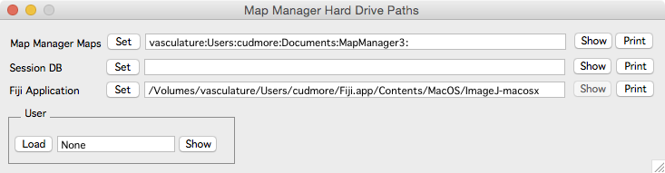

####Hard-drive paths 

- Map Manager 3 Maps

    Location to load and save maps.
    
- Raw Data

    Location to load and save raw data (stacks).
    
- Analysis

    Location to load and save map manager 3 analysis files.
    
- Fiji Application 

    Location of Fiji application. Used when importing a tracing from Fiji.

- User 

    Load a user file to specify program defults. See [user files][3].

[1]: /mapmanager/stack-browser/
[2]: /mapmanager/making-a-map/
[3]: /mapmanager/user-files/

