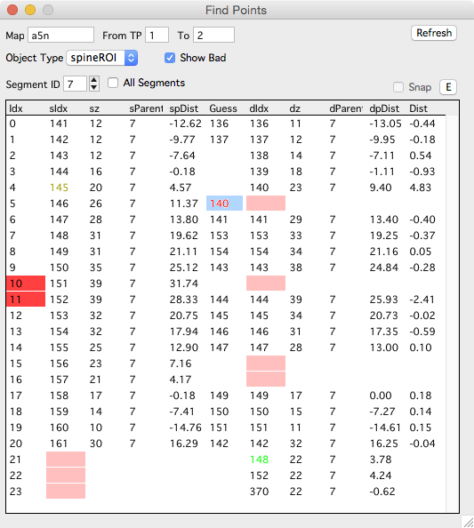
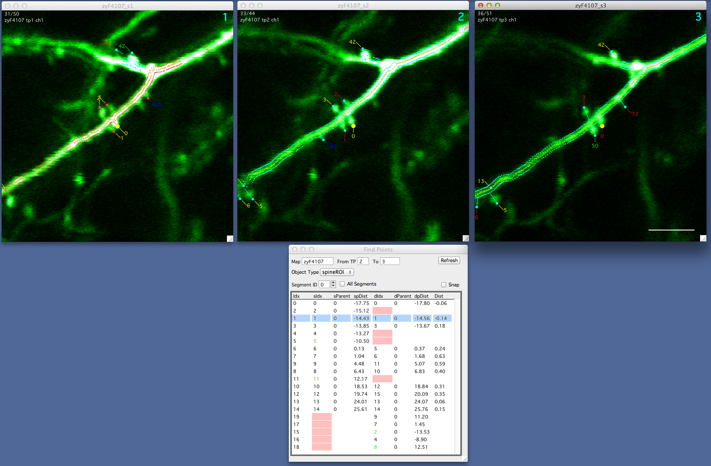

**New on October, 2015.** This documentation needs some work.

The find points panel allows you to browse objects between two timepoints, will show you the best-guess for putative connections, and allow you to connect/disconnect objects across sessions.

To open the find points panel:

  - Right-click a spine in a map and selecting 'Find Points'.
  - Right-click a session in the main Map Manager Panel and selecting 'Find Points'.
  - Right-click a map in the main Map Manager Panel and selecting 'Find Points'.
  

 - The find points panel displays a list of all spines in the source timepoint (sIdx). In this example there are 21 spines in the source timepoint.
 - For each spines in the source timepoint, it shows if it is connected to the destination timepoint (dIdx). It will color the dIdx cell red if there is no connection.
 - Any remaining spines in the destination timepoint (spines not connected to the source timepoint) will be displayed at the bottom of the list. In this example there are 3 of these spines.
 - Each spine in the source timepoint will also have a best 'Guess' connection in the 'Guess' column. For spines, this is using your 'Segment Pivot' for the two segments listed in Find Points and will connect spines across timepoints/sessions that are within 'Connect spines within this distance (um)'. See the Map Manager Options Panel to set this.
 
####Interface

**Source.** Source timepoint (From TP)

**Destination.** Destination timepoint (To timepoint)

**Object Type.** Select the type of objects to display.

**Segment ID.** Limit the list to one segment ID.

**All Segments.** Generate the list for all segments (all objects in the timepoint).

**Refresh.** Will refresh the Find Points list. This is necessary when you add/delete or change connections in the main stack window.

####Interaction

 - Bring up a map run by right-clicking a row and selecting 'Plot Run'.
 - Select an object in the list and it will be propagated to all [run][1] and [map][2] plots.
 - Use the keyboard to scroll through the list.
 - Use left/right arrows to flash the selected object again.
 

####Using the keyboard to connect and disconnect objects

 For a selected row
 
 - 'shift + right-arrow' to commit the 'Guess' to the destination (dIdx).
 - 'del' key to remove the connection. This forces the dIdx to be addition.

When used with a spine run, find points is a reliable way to check the connections between all objects in two timepoints.

All objects in the source timepoint are in the list, followed by any remaining objects in destination timepoint that were not connected to an object in the source timepoints.

By sorting the list with the destination position (dpDist), you get a consice list of all objects in the destination timepoint.

Example usage of find points panel. Here, we have a run of session 1/2/3 (top row). We have positioned the Find Points panel below the stack for session 2. By selecting rows (spines) in Find Points we can browse all spines in session 2, visualize their connections to session 3, and finally edit their connections to session 3 (using the keyboard in FInd Points Panel).

[1]: /mapmanager/run-plot/
[2]: /mapmanager/map-plot/
