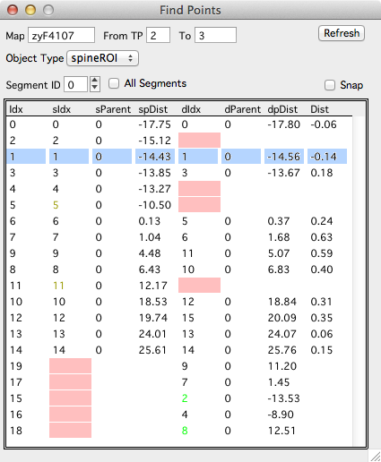

**New on August 2, 2015**

The find points panel allows you to browse all spines between two timepoints.

Open the find points panel by right-clicking a spine in a map and selecting 'Find Points'.

 - The find points panel displays a list of all spines in the source timepoint (sIdx).
 - For each of these spines, it shows if it is connected to the destination timepoint (dIdx). It will color the dIdx cell red if there is no connection.
 - Any remaining spines in the destination timepoint (spines not connected to the source timepoint) will be displayed at the bottom of the list.
 
 
####Interface

**Source.** Source timepoint

**Destination.** Destination timepoint

**Segment ID.** Limit the list to one segment ID

**All Segments.** Generate the list for all segments (all objects in the timepoint).

####Interaction

 - Select an object in the list and it will be propagated to all [run][1] and [map][2] plots.
 - Use the keyboard to scroll through the list.
 - Use left/right arrows to flash the selected object again.
 

When used with a spine run, find points is a reliable way to check the connections between all objects in two timepoints.

All objects in the source timepoint are in the list, followed by any remaining objects in destination timepoint that were not connected to an object in the source timepoints.

By sorting the list with the destination position (dpDist), you get a consice list of all objects in the destination timepoint.

[1]: /mapmanager/run-plot/
[2]: /mapmanager/map-plot/
